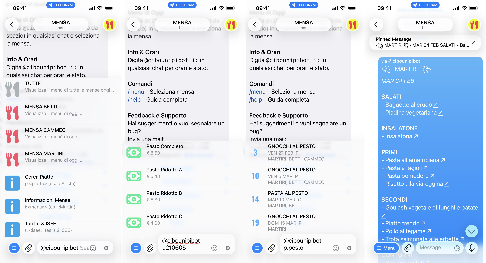
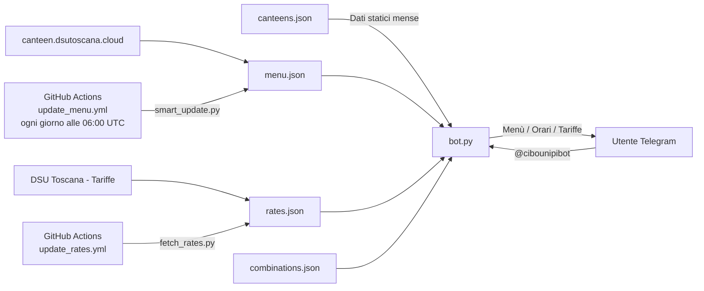

<p align="center">
  
</p>

<h1 align="center"> MENSE </h1>

<p align="center">Un bot Telegram per consultare i menù, gli orari e le tariffe delle mense universitarie di Pisa (DSU Toscana).</p>

<p align="center">Il bot supporta la ricerca inline, la navigazione giornaliera dei menù, il calcolo delle tariffe su base ISEE e la consultazione degli orari in tempo reale.</p>

## Indice

- [Indice](#indice)
- [Struttura del progetto](#struttura-del-progetto)
- [Flowchart](#flowchart)
  - [Flusso Dati](#flusso-dati)
- [Funzionalità](#funzionalità)
  - [Ricerca Inline](#ricerca-inline)
  - [Menu e Navigazione](#menu-e-navigazione)
  - [Info e Orari](#info-e-orari)
  - [Tariffe ISEE](#tariffe-isee)
- [Comandi](#comandi)
- [Data Sources](#data-sources)
- [Problemi noti](#problemi-noti)

<!--

[](https://github.com/plumkewe) 

-->

<h2 align="right"> SCREENSHOT </h2>

<p align="center">
  <picture>
    <source media="(prefers-color-scheme: dark)" srcset="assets/screenshots/bot-b.JPEG">
    <source media="(prefers-color-scheme: light)" srcset="assets/screenshots/bot-w.JPEG">
    
  </picture>
</p>

## Struttura del progetto

<p align="right">(<a href="#indice">indice</a>)</p>

```graphql
├── README.md
├── requirements.txt
├── assets/
│   ├── icons/
│   ├── img/
│   └── logo/
├── data/
│   ├── canteens.json       <- dati delle mense (orari, servizi, coordinate)
│   ├── combinations.json   <- combinazioni di piatti (es. menu fisso)
│   ├── cookies.txt         <- sessione per lo scraping
│   ├── menu.json           <- menù aggiornato quotidianamente
│   └── rates.json          <- tariffe per fascia ISEE
├── scripts/
│   ├── bot.py              <- entrypoint del bot Telegram
│   ├── debug_parser.py     <- utility per debug del parser
│   ├── extract_menu.py     <- scraper menù da canteen.dsutoscana.cloud
│   ├── fetch_combinations.py <- recupera le combinazioni
│   ├── fetch_rates.py      <- scraper tariffe DSU
│   ├── generate_table.py   <- generatore tabella tariffe
│   ├── migrate_json.py     <- utility migrazione dati JSON
│   └── smart_update.py     <- aggiornamento intelligente dei dati
└── .github/
    └── workflows/
        ├── update_menu.yml     <- aggiornamento giornaliero menù (06:00 UTC)
        └── update_rates.yml    <- aggiornamento tariffe
```

## Flowchart

<p align="right">(<a href="#indice">indice</a>)</p>

### Flusso Dati



## Funzionalità

<p align="right">(<a href="#indice">indice</a>)</p>

### Ricerca Inline

È possibile cercare un piatto specifico (es. `p:Arista`) direttamente in qualsiasi chat Telegram senza aprire il bot. I risultati mostrano in quali mense e in quali giorni verrà servito il piatto cercato, con navigazione tra le date.

La ricerca inline si avvia digitando `@cibounipibot` seguito da uno spazio e dalla query. Senza prefisso viene mostrata direttamente la lista delle mense per vedere il menù di oggi.


### Menu e Navigazione

Una volta aperto il menù di una mensa, è possibile:

- Scorrere i giorni con i pulsanti ◀︎ e ▶︎
- Tornare ad oggi con il pulsante ○
- Alternare tra **Pranzo** e **Cena**
- Filtrare per mensa specifica oppure visualizzare **TUTTE** le mense insieme

Per le mense TUTTE, ogni piatto disponibile solo in alcune mense viene annotato con `(Solo NomeMensa)`.


### Info e Orari

Digitando `@cibounipibot i:` è possibile consultare lo stato attuale di ogni mensa (aperta/chiusa), gli orari di pranzo e cena e i servizi disponibili (pizzeria, prendi e vai, menù vegetariano, gluten-free, ecc.).

Il pulsante **APERTE ORA** nella tastiera persistente mostra subito le mense attualmente operative.


### Tariffe ISEE

Digitando `@cibounipibot t:` viene mostrata la tabella completa delle tariffe per fascia ISEE.

Digitando `@cibounipibot t:<valore>` (es. `t:20000`) il bot calcola automaticamente la fascia di appartenenza e mostra la tariffa personalizzata per pranzo, cena e colazione.

## Comandi

<p align="right">(<a href="#indice">indice</a>)</p>

<table>
  <thead>
    <tr>
      <th>Funzione</th>
      <th>Comando</th>
    </tr>
  </thead>
  <tbody>
    <tr>
      <td><b>Menu di Oggi</b><br>Seleziona una mensa e vedi il menù del giorno</td>
      <td><code>@cibounipibot</code> (+ spazio)</td>
    </tr>
    <tr>
      <td><b>Cerca Piatto</b><br>Cerca un piatto per nome in tutte le mense e tutti i giorni</td>
      <td><code>@cibounipibot p:nome piatto</code></td>
    </tr>
    <tr>
      <td><b>Info & Orari</b><br>Stato e orari di una mensa specifica</td>
      <td><code>@cibounipibot i:</code></td>
    </tr>
    <tr>
      <td><b>Tariffe ISEE</b><br>Tabella completa delle tariffe</td>
      <td><code>@cibounipibot t:</code></td>
    </tr>
    <tr>
      <td><b>Tariffa Personalizzata</b><br>Calcola la tariffa per il tuo ISEE</td>
      <td><code>@cibounipibot t:&lt;valore&gt;</code><br>es. <code>t:20000</code></td>
    </tr>
    <tr>
      <td><b>Aperte Ora</b><br>Lista mense aperte in questo momento (tastiera persistente)</td>
      <td>Pulsante <code>APERTE ORA</code></td>
    </tr>
    <tr>
      <td><b>Seleziona Mensa</b></td>
      <td><code>/menu</code></td>
    </tr>
    <tr>
      <td><b>Link Utili DSU</b></td>
      <td><code>/links</code></td>
    </tr>
    <tr>
      <td><b>Guida all'uso</b></td>
      <td><code>/help</code></td>
    </tr>
    <tr>
      <td><b>Benvenuto</b></td>
      <td><code>/start</code></td>
    </tr>
  </tbody>
</table>

## Data Sources

<p align="right">(<a href="#indice">indice</a>)</p>

<table>
  <thead>
    <tr>
      <th align="left">Tipologia Dati</th>
      <th align="left">Fonte Principale</th>
      <th align="left">Dettagli / Link</th>
    </tr>
  </thead>
  <tbody>
    <tr>
      <td><strong>Menù Mense</strong></td>
      <td>DSU Toscana — canteen.dsutoscana.cloud</td>
      <td><a href="https://canteen.dsutoscana.cloud/menu" target="_blank">canteen.dsutoscana.cloud/menu</a> — aggiornato quotidianamente via GitHub Actions</td>
    </tr>
    <tr>
      <td><strong>Tariffe ISEE</strong></td>
      <td>DSU Toscana — sito istituzionale</td>
      <td><a href="https://www.dsu.toscana.it" target="_blank">dsu.toscana.it</a></td>
    </tr>
    <tr>
      <td><strong>Dati Mense</strong></td>
      <td>Raccolta manuale + sito DSU</td>
      <td>Orari, servizi e coordinate in <code>canteens.json</code></td>
    </tr>
  </tbody>
</table>

**Hostato su:**

<p align="center">
  <a>
    <picture>
      <source media="(prefers-color-scheme: dark)" srcset="https://cdn.simpleicons.org/render/white">
      <source media="(prefers-color-scheme: light)" srcset="https://cdn.simpleicons.org/render/black">
      
    </picture>
  </a>
</p>

## Problemi noti

- [ ] **Orari mense:** Gli orari sono salvati staticamente in `canteens.json` e potrebbero non riflettere variazioni stagionali o straordinarie.