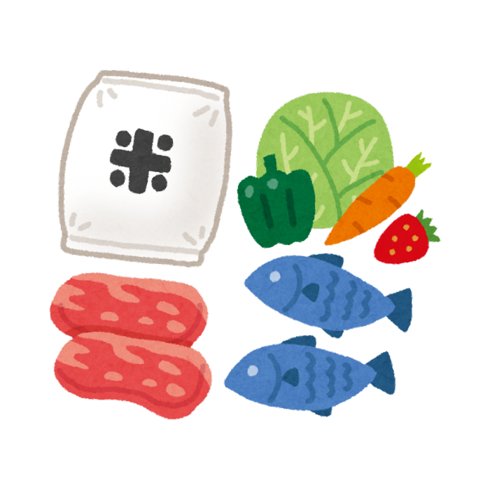
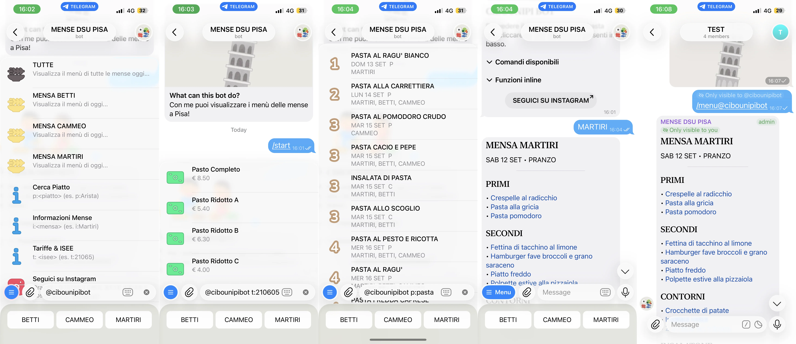
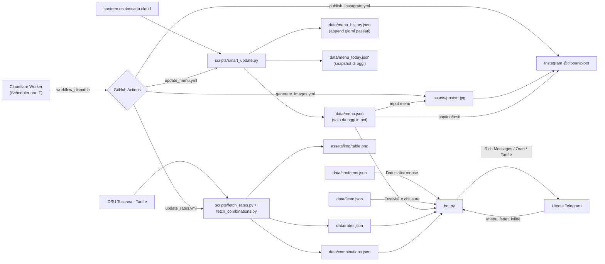

<p align="center">
  
</p>

<h1 align="center"> MENSE </h1>

<p align="center">Un bot Telegram avanzato per consultare i menù, gli orari e le tariffe delle mense universitarie di Pisa (DSU Toscana).</p>

<p align="center">Costruito con supporto nativo a <strong>Telegram Bot API 10.x</strong> e <strong>Rich Messages</strong> (tabelle, mappe GPS integrate, sezioni a scomparsa), <strong>messaggi effimeri nei gruppi</strong> anti-spam, ricerca inline, calcolo tariffe ISEE e monitoraggio orari in tempo reale.</p>

## Indice

- [Indice](#indice)
- [Struttura del progetto](#struttura-del-progetto)
- [Flowchart](#flowchart)
  - [Flusso Dati](#flusso-dati)
- [Funzionalità](#funzionalità)
  - [Telegram Bot API 10.x & Rich Messages](#telegram-bot-api-10x--rich-messages)
  - [Messaggi Effimeri nei Gruppi](#messaggi-effimeri-nei-gruppi)
  - [Menu e Navigazione](#menu-e-navigazione)
  - [Ricerca Inline](#ricerca-inline)
  - [Info e Orari](#info-e-orari)
  - [Tariffe ISEE](#tariffe-isee)
  - [Automazione Social (Instagram)](#automazione-social-instagram)
    - [Pattern Generativi disponibili per i post](#pattern-generativi-disponibili-per-i-post)
- [Comandi](#comandi)
- [Data Sources](#data-sources)
- [Problemi noti](#problemi-noti)

<!--

[](https://github.com/plumkewe)

-->

<h2 align="right"> SCREENSHOT </h2>

<p align="center">
  <picture>
    <source media="(prefers-color-scheme: dark)" srcset="assets/screenshots/bot.webp">
    <source media="(prefers-color-scheme: light)" srcset="assets/screenshots/bot.webp">
    
  </picture>
</p>

## Struttura del progetto

<p align="right">(<a href="#indice">indice</a>)</p>

```graphql
├── README.md
├── requirements.txt
├── assets/
│   ├── fonts/
│   ├── icons/
│   ├── img/
│   ├── logo/
│   ├── numbers/              <- icone giorni per i risultati della ricerca inline
│   ├── posts/                <- immagini generate per i post di Instagram
│   └── screenshots/
├── cloudflare-worker/        <- microservizio per lo scheduler preciso (gestisce fuso orario IT)
├── data/
│   ├── canteens.json         <- dati delle mense (orari, servizi, coordinate)
│   ├── combinations.json     <- combinazioni di piatti (es. menu fisso)
│   ├── cookies.txt           <- sessione per lo scraping
│   ├── feste.json            <- calendario festività, chiusure e aperture speciali
│   ├── menu.json             <- menù da oggi in poi (snapshot corrente)
│   ├── menu_today.json       <- snapshot del solo menù di oggi
│   ├── menu_history.json     <- storico menù passati (append-only)
│   └── rates.json            <- tariffe per fascia ISEE
├── bot.py                    <- entrypoint del bot Telegram (Bot API 10.x, Rich Messages, messaggi effimeri)
├── scripts/
│   ├── extract_menu.py       <- scraper menù da canteen.dsutoscana.cloud
│   ├── fetch_combinations.py <- scraper combinazioni piatti
│   ├── fetch_rates.py        <- scraper tariffe DSU
│   ├── generate_menu_images.py <- genera i post immagine in HTML/stili (Playwright)
│   ├── publish_instagram.py  <- pubblica Carousel su Instagram tramite Graph API
│   └── smart_update.py       <- aggiornamento intelligente dei dati testuali
└── .github/
    └── workflows/
        ├── update_menu.yml       <- aggiornamento giornaliero menù testuale
        ├── generate_images.yml   <- crea e salva le immagini dei post
        ├── publish_instagram.yml <- invia le immagini create su IG
        └── update_rates.yml      <- aggiornamento tariffe
```

## Flowchart

<p align="right">(<a href="#indice">indice</a>)</p>

### Flusso Dati


```mermaid
graph LR
  A["canteen.dsutoscana.cloud"] --> U["scripts/smart_update.py"]
  C["DSU Toscana - Tariffe"] --> R["scripts/fetch_rates.py + fetch_combinations.py"]

  G["Cloudflare Worker<br>(Scheduler ora IT)"] -->|workflow_dispatch| H{"GitHub Actions"}

  H -->|update_menu.yml| U
  U --> B["data/menu.json<br>(solo da oggi in poi)"]
  U --> BH["data/menu_history.json<br>(append giorni passati)"]
  U --> BT["data/menu_today.json<br>(snapshot di oggi)"]

  H -->|update_rates.yml| R
  R --> D["data/rates.json"]
  R --> K["data/combinations.json"]
  R --> T["assets/img/table.png"]

  H -->|generate_images.yml| I["assets/posts/*.jpg"]
  B -->|input menu| I

  H -->|publish_instagram.yml| J["Instagram @cibounipibot"]
  I --> J
  B -->|caption/testi| J

  E["data/canteens.json"] -->|Dati statici mense| F["bot.py"]
  FE["data/feste.json"] -->|Festività e chiusure| F
  B --> F
  D --> F
  K --> F

  F -->|"Rich Messages / Orari / Tariffe"| L["Utente Telegram"]
  L -->|"/menu, /start, inline"| F
```

## Funzionalità

<p align="right">(<a href="#indice">indice</a>)</p>

### Telegram Bot API 10.x & Rich Messages

Il bot adotta nativamente l'interfaccia a blocchi della **Telegram Bot API 10.3** (`sendRichMessage`, `editMessageText` con payload `rich_message` e `InputRichMessageContent`), migliorando radicalmente leggibilità ed estetica:

- **Tabelle native (`table`)**: visualizzazione tabellare pulita per lo stato di apertura delle mense oggi (Pranzo/Cena), gli orari settimanali, le tariffe ISEE per pasto e le date di programmazione dei piatti.
- **Mappe GPS native (`map`)**: visualizzazione integrata direttamente nella chat delle coordinate geografiche della mensa con zoom interattivo.
- **Sezioni collassabili (`details`)**: sezioni a fisarmonica espandibili nel messaggio di benvenuto (`/start`) per consultare l'elenco dei comandi e le scorciatoie inline senza ingombrare la schermata.
- **Pulsanti integrati (`buttons`)**: bottoni d'azione integrati direttamente nel blocco per alternare Pranzo/Cena, passare a Domani/Oggi, tornare all'indice mense (`‹ MENSE`) o aprire mappe e siti web esterni.
- **Tipografia strutturata (`heading`, `paragraph`, `divider`)**: layout moderno con titoli proporzionati, divisori orizzontali e link interattivi.
- **Fallback automatico resiliente**: se il client Telegram o la sessione dell'utente non supporta ancora i Rich Messages, il bot esegue un fallback istantaneo a messaggi standard formattati in Markdown e tastiere inline.

### Messaggi Effimeri nei Gruppi

Per evitare spam nelle chat di gruppo e nei supergruppi di studio, il bot implementa il supporto completo ai **messaggi effimeri** (`ephemeral_message_parameters` con `receiver_user_id`):

- **Comandi effimeri**: digitando comandi come `/start`, `/menu` o `/links` all'interno di un gruppo, il bot invia la risposta in modo che sia **visibile solo ed esclusivamente all'utente richiedente**. Gli altri partecipanti al gruppo non visualizzano il messaggio e non ricevono notifiche.
- **Menzioni silenziose**: evocando il bot in gruppo tramite `@cibounipibot` o `@cibounipibot mensa`, la risposta viene recapitata privatamente ed effimeramente al mittente.
- **Navigazione contestuale**: premendo i pulsanti inline del menù o dei comandi in un gruppo, il bot aggiorna il messaggio effimero esistente (`ephemeral_message_id`) senza inviare nuovi messaggi pubblici.
- **Comandi registrati su misura**: i comandi nei gruppi vengono configurati tramite `setMyCommands` con flag `is_ephemeral: True` nello scope `all_group_chats`.

### Menu e Navigazione

- **Comando `/menu`**: apre la schermata di selezione delle mense mostrando una **tabella di apertura in tempo reale** per il giorno corrente (**Mensa | Pranzo | Cena - Aperta/Chiusa**). Lo stato tiene conto degli orari ordinari di apertura DSU e delle chiusure straordinarie o per festività registrate in `feste.json`.
- **Dettaglio del menù**: visualizza i piatti suddivisi per categoria (*Primi Piatti*, *Secondi Piatti*, *Contorni*, *Insalatone*, *Salati*).
- **Vista aggregata TUTTE**: consultando tutte le mense contemporaneamente, i piatti disponibili solo in determinati refettori vengono annotati automaticamente con `(Solo NomeMensa)`.
- **Controlli rapidi**:
  - Pulsante per alternare istantaneamente **PRANZO** e **CENA**.
  - Pulsante per alternare tra il menù di **OGGI** e quello di **DOMANI**.
  - Pulsante **‹ MENSE** per tornare rapidamente alla tabella di selezione.

### Ricerca Inline

La ricerca inline si attiva digitando `@cibounipibot` in qualsiasi chat o gruppo, seguito da uno spazio:

- **Menù Rapido (query vuota)**: mostra subito la voce `TUTTE` e le singole mense per consultare il menù di oggi come Rich Message, oltre a card interattive di guida rapida con pulsante *"PROVA SUBITO"* e collegamenti a Instagram e GitHub.
- **Cerca Piatto (`p:<nome_piatto>`)**: cerca il piatto desiderato (es. `@cibounipibot p:Arista`) nei menù dei giorni successivi. L'anteprima mostra un badge numerico con i giorni mancanti (`assets/numbers/<N>.png`), mentre il messaggio finale è un Rich Message con la tabella completa di date, pasti (P/C) e mense in cui verrà servito, con pulsante per riaggiornare la ricerca.
- **Info & Orari (`i:` o `i:<nome_mensa>`)**: mostra una scheda completa della mensa con mappa nativa Telegram incorporata, capienza posti a sedere, servizi disponibili, eventuali chiusure festive e tabelle orarie complete di pranzo, cena e servizio *Prendi e vai*, con pulsanti diretti per sito DSU e Google Maps.
- **Tariffe ISEE (`t:`)**: visualizza la tabella comparativa di tutte le fasce ISEE con i prezzi per pasto completo e pasti ridotti (A, B, C) e legenda dettagliata dei vassoi.
- **Tariffa Personalizzata (`t:<valore>`)**: calcola la tariffa esatta inserendo il proprio ISEE numerico (es. `t:20000`) o parole chiave per la borsa di studio (es. `t:borsa`, `t:dsu`, `t:borsista`), generando un Rich Message con la tabella dei costi specifici.

### Info e Orari

In chat privata è disponibile anche la consultazione rapida tramite tastiera persistente:
- **Pulsanti Mensa (MARTIRI, BETTI, CAMMEO)**: inviano istantaneamente il menù odierno della mensa selezionata.

### Tariffe ISEE

Il sistema di calcolo tariffe gestisce le fasce DSU Toscana:
- Calcolo automatico della fascia di appartenenza per qualsiasi valore ISEE inserito.
- Supporto per studenti idonei e borsisti ARDSU con pasti gratuiti.
- Dettaglio della composizione di ogni tipologia di pasto (Completo, Ridotto A, Ridotto B, Ridotto C).

### Automazione Social (Instagram)

Oltre al bot Telegram, il progetto include un sistema automatizzato per la **pubblicazione giornaliera dei menù su Instagram**. L'infrastruttura è basata su GitHub Actions suddivise in tre fasi:

1. **`update_menu.yml`**: Aggiorna i testi dei menù da oggi in poi salvandoli in `menu.json`, genera `menu_today.json` e sposta i giorni passati in `menu_history.json` (append).
2. **`generate_images.yml`**: Tramite uno script Python nativo (`generate_menu_images.py`), il sistema genera le grafiche ("slide") a partire da template, scrivendo testo personalizzato e uno sfondo procedurale con geometrie dinamiche e vibranti. **Il design cambia dinamicamente** e il sistema alterna vari colori e pattern su base settimanale e giornaliera.
3. **`publish_instagram.yml`**: Utilizzando le **Graph API di Meta**, le immagini generate vengono raggruppate e pubblicate come "Carousel" sul profilo Instagram dedicato ai menù.

#### Pattern Generativi disponibili per i post

|                                            Dot Grid                                            |                                            Diagonal Stripes                                             |                                              Crosshatch                                               |                                              Diamond Grid                                               |
| :--------------------------------------------------------------------------------------------: | :-----------------------------------------------------------------------------------------------------: | :---------------------------------------------------------------------------------------------------: | :-----------------------------------------------------------------------------------------------------: |
|   |    |        |        |
|                                           **Zigzag**                                           |                                         **Concentric Circles**                                          |                                             **Plus Grid**                                             |                                                **Waves**                                                |
|     |  |         |               |
|                                         **Triangles**                                          |                                              **X Shapes**                                               |                                         **Vertical Stripes**                                          |                                         **Horizontal Stripes**                                          |
|  |            |  |  |

Per far sì che l'esecuzione di questi workflow sia precisa e rispetti l'orario italiano (gestendo in automatico il cambio tra ora legale e solare), i comandi vengono avviati da uno scheduler configurato tramite **Cloudflare Workers**. Questo risolve i noti problemi di ritardo e imprecisione dei classici `cron` integrati nativamente in GitHub Actions.

## Comandi

<p align="right">(<a href="#indice">indice</a>)</p>

<table>
  <thead>
    <tr>
      <th align="left">Ambito / Funzione</th>
      <th align="left">Comando / Query</th>
      <th align="left">Descrizione</th>
    </tr>
  </thead>
  <tbody>
    <tr>
      <td><b>Benvenuto & Guida</b></td>
      <td><code>/start</code></td>
      <td>Messaggio di benvenuto con sezioni a scomparsa (comandi, guida inline, canali). Nei gruppi è effimero.</td>
    </tr>
    <tr>
      <td><b>Seleziona Mensa</b></td>
      <td><code>/menu</code></td>
      <td>Tabella in tempo reale delle aperture di oggi (Pranzo/Cena) e bottoni di selezione menù. Nei gruppi è effimero.</td>
    </tr>
    <tr>
      <td><b>Link Utili DSU</b></td>
      <td><code>/links</code></td>
      <td>Elenco canali del bot e canali ufficiali DSU Toscana. Nei gruppi è effimero.</td>
    </tr>
    <tr>
      <td><b>Menù Rapido Inline</b></td>
      <td><code>@cibounipibot</code> (+ spazio)</td>
      <td>Elenco mense per il menù di oggi, card guida all'uso interattive, link Instagram e GitHub.</td>
    </tr>
    <tr>
      <td><b>Cerca Piatto</b></td>
      <td><code>@cibounipibot p:nome</code><br>es. <code>p:Arista</code></td>
      <td>Cerca un piatto nei menù futuri con tabella di date, pasti, mense e bottone AGGIORNA.</td>
    </tr>
    <tr>
      <td><b>Info & Orari Mensa</b></td>
      <td><code>@cibounipibot i:</code><br>oppure <code>i:nome</code></td>
      <td>Scheda con mappa GPS nativa, capienza, servizi e tabella orari settimanali completa.</td>
    </tr>
    <tr>
      <td><b>Tabella Tariffe ISEE</b></td>
      <td><code>@cibounipibot t:</code></td>
      <td>Tabella comparativa completa di tutte le fasce ISEE (pasto completo e ridotti A, B, C).</td>
    </tr>
    <tr>
      <td><b>Tariffa Personalizzata</b></td>
      <td><code>@cibounipibot t:&lt;valore&gt;</code><br>es. <code>t:20000</code> o <code>t:borsa</code></td>
      <td>Calcola la fascia esatta e mostra la tabella dei costi per il proprio ISEE o status di borsista.</td>
    </tr>
    <tr>
      <td><b>Menù Mensa Istantaneo</b></td>
      <td>Pulsante <code>MARTIRI</code> / <code>BETTI</code> / <code>CAMMEO</code></td>
      <td>(Chat privata) Invia subito il menù di oggi per la mensa selezionata dalla tastiera persistente.</td>
    </tr>
    <tr>
      <td><b>Menzione Gruppo</b></td>
      <td><code>@cibounipibot [mensa]</code></td>
      <td>(Gruppi) Evocazione con risposta effimera (benvenuto o menù di oggi), visibile solo a chi invia il messaggio.</td>
    </tr>
  </tbody>
</table>

## Data Sources

<p align="right">(<a href="#indice">indice</a>)</p>

<table>
  <thead>
    <tr>
      <th align="left">Tipologia Dati</th>
      <th align="left">Fonte Principale</th>
      <th align="left">Dettagli / Link</th>
    </tr>
  </thead>
  <tbody>
    <tr>
      <td><strong>Menù Mense</strong></td>
      <td>DSU Toscana — canteen.dsutoscana.cloud</td>
      <td><a href="https://canteen.dsutoscana.cloud/menu" target="_blank">canteen.dsutoscana.cloud/menu</a> — aggiornato quotidianamente via GitHub Actions</td>
    </tr>
    <tr>
      <td><strong>Tariffe ISEE</strong></td>
      <td>DSU Toscana — sito istituzionale</td>
      <td><a href="https://www.dsu.toscana.it" target="_blank">dsu.toscana.it</a></td>
    </tr>
    <tr>
      <td><strong>Dati Mense</strong></td>
      <td>Raccolta manuale + sito DSU</td>
      <td>Orari, servizi e coordinate in <code>data/canteens.json</code></td>
    </tr>
    <tr>
      <td><strong>Festività e Chiusure</strong></td>
      <td>DSU Toscana — comunicazioni ufficiali</td>
      <td>Periodi di chiusura ordinaria/straordinaria in <code>data/feste.json</code></td>
    </tr>
  </tbody>
</table>

**Hostato su:**

<p align="center">
  <a>
    <picture>
      <source media="(prefers-color-scheme: dark)" srcset="https://cdn.simpleicons.org/render/white">
      <source media="(prefers-color-scheme: light)" srcset="https://cdn.simpleicons.org/render/black">
      
    </picture>
  </a>
</p>

## Problemi noti

- [ ] **Orari mense:** Gli orari base sono salvati in `canteens.json` con eccezioni in `feste.json`; possono richiedere aggiornamenti manuali in caso di comunicazioni straordinarie dell'ente DSU.
